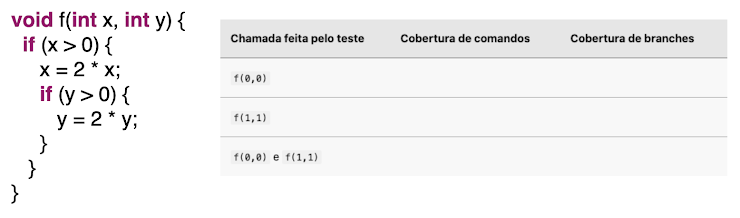
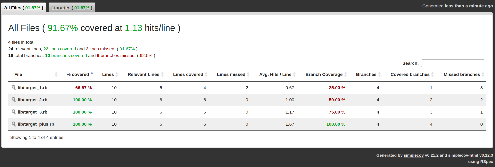

# Teste coverage line covered and branches covered

Outras Definições de Cobertura de Testes

> tais como cobertura de funções (percentual de funções que são executadas por um teste), cobertura de chamadas de funções (dentre todas as linhas de um programa que chamam funções, quantas são, de fato, exercitadas por testes), cobertura de branches (% de branches de um programa que são executados por testes; um comando if sempre gera dois branches: quando a condição é verdadeira e quando ela é falsa).
[Fonte](https://engsoftmoderna.info/cap8.html#outras-defini%C3%A7%C3%B5es-de-cobertura-de-testes)

No código deste repo está praticado o exercício abaixo:

Seja a seguinte função. Observe que ela possui quatro comandos, sendo dois deles if. Logo, esses dois ifs geram quatro branches: 

Supondo o código abaixo, preencha a tabela ao lado, com os valores da cobertura de comandos e cobertura de branches obtidos com os testes especificados na primeira coluna (ou seja, a primeira coluna define as chamadas da função f que o teste realiza).



Fonte: [Engenharia de Software Moderna - Teste - Outras Definições de Cobertura de Testes](https://engsoftmoderna.info/cap8.html#outras-defini%C3%A7%C3%B5es-de-cobertura-de-testes)

## Execute os testes
```ruby
bundle exec rspec
```

## Coverage
```ruby
open coverage/index.html
```

